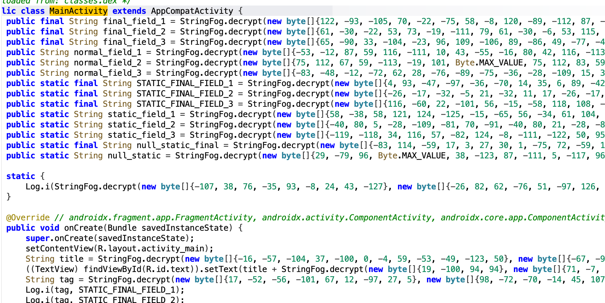
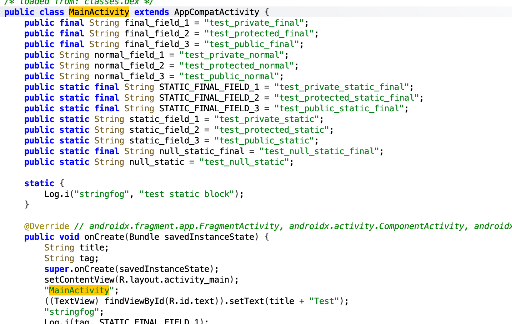

# APK Deobfuscation Toolkit

This project provides a framework for deobfuscating Android applications by combining static analysis with dynamic instrumentation. It uses Jadx for decompilation and script-based modification, communicating with a backend server (Frida or Unidbg) that performs live decryption by hooking into the running application.

## Core Principle

The deobfuscation process follows a client-server model:

1. **Server (Dynamic Analysis)**: A Python server using Frida (for Java/Kotlin code) or Unidbg (for native code) runs on a host machine. It hooks into the target application on a device or emulator to gain access to its internal decryption functions.

2. **Client (Static Analysis)**: A Jadx script (`.jadx.kts`) is loaded into the `jadx-gui`. This script traverses the decompiled code, identifies calls to obfuscated methods (e.g., encrypted string lookups), and sends the encrypted data to the server.

3. **Patching**: The server executes the real decryption function from the app and returns the plaintext result to the Jadx script, which then replaces the original method call with the decrypted value in the decompiled code.

## Prerequisites

- JDK (Version 11 or newer recommended)
- Python 3
- A rooted Android device or emulator with `frida-server` running (for the Frida-based approach).

## Usage

1. **Start the Decryption Server**:
    - Navigate to the server directory, e.g., `client/frida_server/`.
    - Run the server: `python main.py`. The server will wait for requests from Jadx.

2. **Analyze in Jadx**:
    - Open `jadx-gui` and load the target `.apk` or `.dex` file.

3. **Apply Deobfuscation Script**:
    - In `jadx-gui`, go to the `Script` menu and select `Run script...`.
    - Choose the appropriate `.jadx.kts` script from one of the `projects/` subdirectories (e.g., `projects/demo2_deeper_replace/replace_obfuscated_strings.jadx.kts`).
    - The script will execute, communicate with the running server, and patch the code in the Jadx UI. View the log output in the `Log` panel at the bottom.

## Project Examples

- **`demo1_sample_replace`**: A basic example of replacing a simple method call.

- **`demo2_deeper_replace`**: Demonstrates deobfuscating encrypted strings by calling a live decryption method.

- **`demo3_anti_stringfog`**: A specific example for handling strings obfuscated with a simple XOR operation.

## Thanks

- [jadx](https://github.com/skylot/jadx/)
- [frida](https://github.com/frida/frida)
